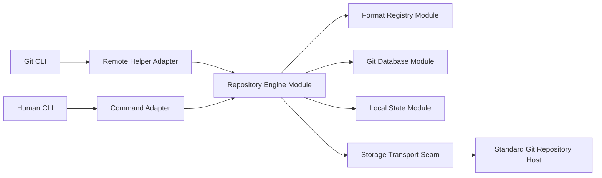

# git-remote-cloak v1 Architecture and Product Specification

Status: decision-ready
Implementation language: Go
Supported platforms: Linux and macOS; Windows through WSL
Product model: single-owner private Git backup

## 1. Decision

Build `git-remote-cloak` as an independent Git remote helper and human-facing
command-line program.

An Authorized Host works with an ordinary plaintext Git repository. A standard
Git Repository Host stores a Ciphertext Repository that does not expose:

- file contents;
- file or directory paths;
- commit or tag messages; or
- Logical Ref names.

The same binary serves two roles:

- Git invokes `git-remote-cloak` for a `cloak::` remote; and
- a person invokes `git-remote-cloak init`, `clone`, and maintenance commands.

No second binary, provider-specific service, mounted encrypted filesystem, Git
filter, or server-side plugin is required.

No maintained existing product satisfies this contract unchanged. Cloak adopts
Git remote-helper and native-pack plumbing plus the encrypted-pack and encrypted
manifest precedent demonstrated by `git-remote-gcrypt`. It does not adopt that
project's code, license obligations, GPG trust model, whole-history-per-push
hosted representation, or force-update semantics.

## 2. Product contract

### 2.1 Primary use case

The Repository Owner wants GitHub, GitLab, or another ordinary Git server to act
as a durable private backup for a small repository, primarily Markdown and
similar documents with some ordinary binary files.

Daily work remains ordinary Git:

```text
git add .
git commit
git push origin main
git fetch origin
git pull origin main
```

The Repository Owner supplies one per-repository Recovery Secret to every
Authorized Host. A service may persist that Secret in its own environment or
secret file and must continue to clone, fetch, and push after restart without an
interactive unlock step.

### 2.2 Recovery guarantee

Given:

- a reachable valid Ciphertext Snapshot;
- the correct Recovery Secret; and
- a supported Cloak reader,

Cloak recovers every pushed reachable Logical Ref and its exact original Git
objects. The Recovered Repository preserves original object IDs, paths,
contents, commit and tag messages, authors, timestamps, signatures, branches,
and tags.

Cloak does not recover local state that was never pushed, including uncommitted
worktree changes, the index, reflogs, stashes, hooks, local Git configuration,
bisect state, or remote-tracking refs.

### 2.3 Privacy guarantee

The Repository Host is untrusted with Protected Plaintext even when the hosted
repository is private.

The Repository Host may observe:

- the fixed public Storage Ref;
- public format and capability metadata;
- a random Repository ID;
- ciphertext object identifiers and sizes;
- Storage History topology and commit count;
- upload and access timing;
- ciphertext change patterns; and
- repository growth.

These observations are accepted leakage in v1. Cloak does not claim traffic
analysis resistance, size hiding, access-pattern hiding, or deniability.

### 2.4 Explicit exclusions

V1 excludes:

- multiple owners, invitations, shared membership, and per-member revocation;
- native Windows binaries;
- Git LFS;
- partial clone filters and promisor objects;
- erasure guarantees for ciphertext retained by a Repository Host;
- recovery of non-pushed local state;
- provider-specific APIs;
- automatic recursive secret orchestration for submodules; and
- an ordinary Git client operating directly on the Ciphertext Repository
  without Cloak and the Recovery Secret.

Ordinary Git binary blobs remain supported. Each private submodule is an
independent Cloak repository with its own Recovery Secret.

## 3. Trust and threat model

### 3.1 Trusted

- The Repository Owner.
- Authorized Hosts while they hold the Recovery Secret.
- The local Git executable and Cloak binary on an Authorized Host.
- The operating system cryptographic random-number generator.
- A correctly pinned and validated production cryptographic dependency.

### 3.2 Untrusted or fallible

- Repository Host operators, storage, logs, and administrators.
- Network transport for confidentiality and integrity; Cloak still relies on
  ordinary Git transport for availability and host authentication.
- Repository Host history retention and garbage-collection policy.
- Remote data, including well-formed but malicious or replayed objects.
- Interrupted processes, lost responses, concurrent writers, damaged cache
  entries, and partial uploads.

### 3.3 Defended attacks

V1 must fail closed for:

- modification, substitution, truncation, or omission of authenticated
  metadata and encrypted chunks;
- moving a ciphertext object between repositories, formats, payloads, or chunk
  positions;
- unsupported repository formats or required features;
- stale or divergent logical pushes;
- known whole-repository rollback when a trusted Rollback Checkpoint exists;
- Repository Host attempts to introduce additional public refs; and
- accidental leakage of Protected Plaintext through Cloak's remote
  representation, diagnostics, or crash journals.

### 3.4 Limits

Authenticated encryption does not establish freshness. A fresh clone with no
trusted checkpoint can prove that a snapshot authenticates under the Recovery
Secret, but cannot prove that the Repository Host returned the newest valid
snapshot.

If an Authorized Host or the Recovery Secret is compromised, the attacker can
recover every retained snapshot encrypted by that Secret. Rekey cannot make a
Repository Host erase old ciphertext.

Availability remains dependent on the Repository Host, local Secret custody,
and at least one retained valid Ciphertext Snapshot.

## 4. User workflows

### 4.1 Initialize an existing local repository

```text
git-remote-cloak init <remote-name> <repository-url>
```

The command:

1. runs inside an existing Git repository, including an unborn repository;
2. obtains or interactively creates a Recovery Secret;
3. verifies that the Repository Host has no refs, or only a valid Storage Ref
   for the same Repository ID and Secret;
4. publishes an empty Ciphertext Snapshot only for an empty Repository Host,
   while treating an existing matching Ciphertext Repository as idempotent;
5. configures `<remote-name>` as `cloak::<repository-url>`; and
6. records the symbolic local `HEAD` as encrypted Logical HEAD.

It does not push any local branch, tag, commit, index entry, or worktree change.
It is idempotent only when the existing remote name and Cloak identity match.
There is no `init --force`.

A detached `HEAD` requires `--default-branch`. The owner may later run:

```text
git-remote-cloak set-head <remote-name> <branch>
```

### 4.2 Clone

Human-friendly form:

```text
git-remote-cloak clone <repository-url> [directory]
```

Ordinary Git form:

```text
git clone cloak::<repository-url> [directory]
```

Both forms recover the same Logical Repository and configure `origin` with the
Cloak URL. Recovery occurs in a mode-`0700` temporary directory. Cloak
authenticates the snapshot, imports packs, restores refs and Logical HEAD,
compares expected ref targets, runs `git fsck --full`, and atomically renames
the completed directory.

Cloak never merges into or overwrites a non-empty destination. A failed clone
does not leave a usable partial plaintext checkout.

### 4.3 Push, fetch, and pull

The remote helper implements the documented direct `list`, `fetch`, and `push`
remote-helper protocol paths.

- `list` decrypts and advertises Logical Refs and Logical HEAD.
- `fetch` obtains the required encrypted objects, validates them, imports the
  native packs, and then allows Git to update local refs.
- `push` applies all requested Logical Ref changes to one new authenticated
  manifest and publishes them through one Storage Ref compare-and-swap.
- `pull` is ordinary Git fetch followed by the user's selected Git integration
  strategy. Cloak never performs a logical merge.

Branches, annotated and lightweight tags, deletions, normal force push, and
force-with-lease are supported. A multi-ref push is all-or-none.

### 4.4 Secret sources

Accepted sources are:

- `CLOAK_RECOVERY_SECRET`;
- the file named by `CLOAK_RECOVERY_SECRET_FILE`; and
- `--secret-file PATH` for explicit `init` and `clone`.

More than one configured source is an error. Cloak never accepts
`--secret VALUE`, stores the Secret in Git configuration, writes it to cache or
journals, or transmits it to the Repository Host.

Human `init` and `clone` may use a masked terminal prompt. A Git-invoked remote
helper never prompts. A non-interactive `init` must receive a Secret and never
prints one.

A broadly readable Secret file produces a warning rather than a hard failure,
because service and container environments may require that arrangement.
Directories, empty files, unreadable files, and invalid mnemonics fail.

## 5. Architecture

The design uses a small number of deep Modules. Human commands and the
remote-helper protocol are Adapters over the same Repository Engine; they do
not implement separate storage or cryptographic behavior.



### 5.1 Command Frontends Module

Responsibilities:

- parse either remote-helper protocol input or explicit command-line input;
- acquire the Recovery Secret according to the command's interaction policy;
- translate failures into Git-compatible or human-readable output; and
- redact Secret-bearing material.

Adapters:

- Remote Helper Adapter: non-interactive, protocol-stable, machine-oriented.
- Command Adapter: prompts and confirmations where explicitly allowed.

The Module contains no snapshot-building, Git-pack, cache, or cryptographic
policy.

### 5.2 Repository Engine Module

The Repository Engine is the primary deep Module. Its small Interface exposes
repository-level operations such as:

- inspect and advertise a remote repository;
- initialize or recover a repository;
- fetch required logical objects;
- publish a Logical Ref transaction;
- run Compaction, Rekey, or Format Migration; and
- diagnose a repository without mutation.

It hides:

- Logical Ref validation;
- transaction planning and retry;
- cache selection;
- snapshot construction and validation;
- rollback-checkpoint rules;
- maintenance rebuilds; and
- the ordering of immutable uploads and Storage Ref publication.

Compaction, Rekey, and Format Migration reuse one internal snapshot-rebuild
mechanism with different identity, key, generation, format, ref-selection, and
publication policies. They are not separate shallow public services.

### 5.3 Format Registry Module

The Format Registry is the boundary between repository behavior and byte-level
Ciphertext Repository representation.

Its Interface:

- probes a bounded Bootstrap Preamble;
- selects an exact reader or writer by format and required features;
- authenticates and decodes a Ciphertext Snapshot;
- encodes a complete candidate Ciphertext Snapshot; and
- reports explicit read and write capabilities.

Each format implementation is an Adapter behind this Interface. Generic CBOR
parsing does not imply write compatibility. Unknown framing, major versions,
or required features fail closed.

The Repository Engine does not inspect format-specific encrypted fields.

### 5.4 Git Database Module

This Module isolates native Git plumbing:

- enumerate selected refs and reachable objects;
- create self-contained native Git packs;
- import packs;
- restore refs and symbolic HEAD;
- preserve shallow boundaries;
- compare exact reachable object IDs; and
- run `git fsck --full`.

Git SHA-1 and Git SHA-256 object formats are capabilities of this Module, not
assumptions embedded into encrypted metadata codecs.

### 5.5 Storage Transport Seam

The Storage Transport is the principal external Seam. Its Interface supports:

- read the current Storage Ref;
- fetch required outer Git objects;
- upload immutable outer Git objects; and
- publish a Storage Ref update against an expected previous value.

The production Adapter delegates to ordinary Git fetch and push over local,
SSH, or HTTPS transports. Compare-and-swap publication uses the expected
Storage Ref value, equivalent to force-with-lease for the internal ref. The
Adapter never stores or interprets the Recovery Secret.

A local bare-repository Adapter provides deterministic integration and fault
injection tests without changing Repository Engine behavior.

### 5.6 Local State Module

This Module owns:

- `.git/cloak/cache/`;
- `.git/cloak/transactions/`; and
- `.git/cloak/state`.

It enforces atomic local replacement, restrictive permissions for created
plaintext temporary data, Secret-free persistence, cache validation, crash
journal recovery, and Rollback Checkpoints.

## 6. Ciphertext Repository representation

### 6.1 Public Git surface

The Repository Host exposes exactly one ref:

```text
refs/heads/cloak-storage
```

The hosted default branch, if required by the provider, points to this Storage
Ref. No Logical Ref name is a public Git ref.

Every ordinary Storage History commit uses a constant non-sensitive message.
Its tree contains only fixed format paths and opaque identifiers. It does not
mirror original files or directories.

### 6.2 Complete snapshots

Every published Storage commit references a complete Ciphertext Snapshot:

1. Bootstrap Preamble;
2. authenticated Bootstrap Header;
3. encrypted Encrypted Manifest;
4. one encrypted Encrypted Pack Index for each live Pack Payload; and
5. immutable Encrypted Pack Chunks.

The current snapshot tree references every ciphertext object needed for full
recovery. Unchanged ciphertext objects are reused across Storage commits.

### 6.3 Bootstrap Preamble

The bounded public preamble contains only:

- Cloak magic bytes;
- bootstrap framing version;
- repository format major and minor versions;
- bounded Bootstrap Header length; and
- required feature identifiers.

The preamble exists only to select a parser. The authenticated Bootstrap Header
covers it, and the parsed header must agree with it. Implementations apply
strict allocation and nesting limits before processing attacker-controlled
lengths.

### 6.4 Bootstrap Header

The public authenticated header contains:

- Repository ID;
- format and cryptographic suite identifiers;
- fixed repository chunk-size limit;
- storage generation;
- current Encrypted Manifest locator; and
- the Storage Ref value replaced by this generation when applicable.

It contains no Protected Plaintext. Header authentication occurs before any
encrypted manifest or payload is trusted.

### 6.5 Encrypted Manifest

The Encrypted Manifest is authoritative for:

- every Logical Ref name and exact original object ID;
- Logical HEAD;
- repository object format;
- storage generation;
- the live Pack Payload catalog;
- Compaction baseline data;
- migration-source metadata when applicable; and
- required snapshot features.

Logical Ref names never appear in the Bootstrap Header or outer Git refs.

### 6.6 Pack Payloads and indexes

Git packs are created before encryption. Each v1 Pack Payload is self-contained:
it does not omit a delta base that exists only in another Pack Payload.

An Encrypted Pack Index records enough original-object identity and location
information for an Authorized Host to select Pack Payloads without exposing Git
object IDs to the Repository Host.

Pack Payload plaintext is split into independently authenticated chunks with a
per-repository fixed maximum plaintext size. The v1 default is 32 MiB.

### 6.7 Opaque outer identifiers

Encrypted Pack Chunks are addressed by:

```text
lowercase-unpadded-base32(SHA-256(complete-ciphertext))
```

Where a stable keyed identifier is required for a non-content-addressed format
role, Cloak uses:

```text
c1- + lowercase-unpadded-base32(HMAC-SHA-256(purpose-key, canonical-input))
```

The resulting value is one portable path component and never contains `/`.
Purpose keys are distinct. There is no per-original-file ciphertext filename:
original paths exist only inside encrypted Git objects.

## 7. Cryptographic format

### 7.1 Recovery Secret

The Recovery Secret is 32 bytes generated by the operating system CSPRNG. Its
primary user representation is:

```text
cloak-v1:<24-word BIP-39 English entropy/checksum encoding>
```

Cloak uses BIP-39 only as a reversible 256-bit entropy and checksum encoding.
It does not perform wallet seed derivation, accept a user-created passphrase, or
use an envelope stored in the Ciphertext Repository.

Possession of the mnemonic is sufficient to recover the repository.

### 7.2 Key derivation

HKDF-SHA-256 binds every derived key to:

- the Recovery Secret;
- Repository ID;
- repository format and cryptographic suite;
- a fixed Cloak protocol label;
- a distinct purpose label; and
- a purpose-specific context such as payload identity.

At minimum, v1 derives independent keys for:

- Bootstrap Header authentication;
- Encrypted Manifest encryption;
- Encrypted Pack Index encryption;
- Pack Payload encryption;
- stable metadata identifiers; and
- any additional format purpose named by the normative schema.

Keys and contexts for one repository, format, purpose, payload, or metadata role
must not be interchangeable with another.

### 7.3 Authenticated encryption

V1 uses AES-256-GCM-SIV as specified by RFC 8452. The Go implementation uses a
pinned, reviewed Tink Go v2 release and its public AES-256-GCM-SIV
no-prefix/RAW primitive. The architecture review verified support in Tink Go
v2.7.0.

Cloak does not implement AES-GCM-SIV, import Tink internal packages, or maintain
a cryptographic fork.

Each encrypted record uses Tink's public framing:

```text
96-bit random nonce || ciphertext || 128-bit authentication tag
```

The nonce is generated by the cryptographic implementation for each encryption
operation. Chunk index is not used as an implicit nonce.

Associated data canonically binds, as applicable:

- protocol and format suite;
- Repository ID;
- record kind;
- payload or metadata identity;
- chunk index;
- final-chunk marker;
- plaintext length; and
- any parent structural identity needed to prevent substitution.

The final chunk is explicitly authenticated as final, so truncation or
extension cannot be interpreted as a valid payload.

### 7.4 Metadata encoding

Structured metadata uses deterministic CBOR governed by a versioned normative
CDDL schema. The schema defines:

- canonical field encodings;
- exact integer widths and byte-string meanings;
- allocation and collection limits;
- required and optional fields;
- associated-data encodings;
- cryptographic-suite identifiers; and
- forward-compatibility behavior.

The production writer must pass canonical byte-for-byte format vectors.
Prototype canonical JSON and its HMAC/XOR codec are not part of the format.

## 8. Publication and recovery algorithms

### 8.1 Normal publication

For one logical push, the Repository Engine:

1. reads and authenticates the latest Ciphertext Snapshot;
2. validates normal fast-forward, forced, deletion, and lease rules against the
   current Logical Refs;
3. verifies that all required local Git objects exist;
4. rejects newly reachable Git LFS pointer blobs;
5. creates a self-contained native Git Pack Payload;
6. encrypts and indexes the new payload;
7. constructs one complete candidate Encrypted Manifest;
8. restores and validates the candidate logical state locally;
9. uploads immutable ciphertext objects;
10. creates the next Storage commit; and
11. compare-and-swap updates the Storage Ref.

The operation reports success only after publication is confirmed. Failure
before the final ref update leaves the previous snapshot authoritative.
Unreachable uploaded ciphertext is safe garbage.

### 8.2 Concurrent writers

If another writer wins the Storage Ref race, Cloak refetches and revalidates.

- Compatible updates, such as different Logical Refs, may be rebuilt and
  retried up to three times.
- Divergent updates return ordinary non-fast-forward or stale-lease failures.
- Cloak never creates a logical merge.
- Every Logical Ref in one push transaction is published together or none is.

### 8.3 Fetch and recovery

Cloak:

1. fetches the Storage Ref and Bootstrap data;
2. validates format support and authenticates the header;
3. checks the Rollback Checkpoint when present;
4. decrypts the manifest and relevant indexes;
5. reuses only independently validated ciphertext cache entries;
6. downloads and authenticates required chunks;
7. reconstructs and imports native Git packs;
8. verifies expected object IDs and Logical Ref targets;
9. restores Logical HEAD and shallow state where requested; and
10. runs full repository validation before exposing a newly cloned repository.

A depth-limited clone has ordinary Git semantics: limited commit history and a
complete current checkout. A cache miss may still require every live Pack
Payload in v1.

## 9. Local persistence and failure semantics

### 9.1 Cache

`.git/cloak/cache/` contains only reconstructable wrapper Git objects,
ciphertext chunks, encrypted indexes, and authenticated metadata. It contains
no Recovery Secret or plaintext Git object payload.

Cache loss or corruption may reduce performance but not recoverability. Invalid
entries are isolated and rebuilt. `git-remote-cloak cache clear` removes only
reconstructable data.

### 9.2 Crash journals

`.git/cloak/transactions/` stores Secret-free transaction intent, starting
Storage Ref, and prepared Storage commit identity.

On retry:

- a transaction not yet published may be rebuilt safely;
- a transaction whose response was lost is recognized in current Storage
  History or by authenticated Logical Ref state; and
- a fetch installs objects and refs only after validation.

### 9.3 Rollback Checkpoint

`.git/cloak/state` records:

- Repository ID;
- highest authenticated generation observed; and
- last-seen Storage Ref.

Generation regression, same-generation substitution, or an unexplained Storage
History reversal fails closed. Services may export and retain this checkpoint
outside the repository.

### 9.4 Diagnostics

```text
git-remote-cloak doctor <repository-url>
```

`doctor` is read-only and has structured output. It checks header and manifest
authentication, chunk availability and integrity, pack/index consistency,
Logical Ref targets, and the recovered Git object graph.

It may identify an older authenticated recoverable generation, but ordinary
operations never silently downgrade. Explicit historical recovery writes a
separate local repository and does not mutate the remote.

Diagnostics may include provider errors, ciphertext identifiers, and
ciphertext sizes. They must not include Protected Plaintext, Recovery Secrets,
derived keys, or Secret-bearing environment values.

## 10. Maintenance operations

### 10.1 Compaction

Compaction preserves:

- Recovery Secret;
- Repository ID;
- repository format;
- Logical Refs and Logical HEAD;
- original Git objects and object IDs; and
- monotonically increasing storage generation.

It rebuilds the complete Logical Repository as one optimized self-contained
Pack Payload, validates the candidate, and compare-and-swap force-re-roots only
Storage History with a parentless Storage commit.

Automatic Compaction runs synchronously before the logical push that would:

- create the thirty-third live Pack Payload; or
- make ciphertext added since the previous Compaction reach 50% of the
  previous compacted snapshot size.

It is not a daemon. Services may configure:

```text
remote.<name>.cloakAutoCompact=false
```

They may run `git-remote-cloak compact <remote-name>` in a maintenance window.
Pushes beyond the threshold continue only with explicit capacity warnings.

### 10.2 Rekey

Rekey uses a complete local Logical Repository as authority. It does not require
the old Recovery Secret.

By default, it selects all local heads and tags. Notes and custom refs require
explicit refspecs. It excludes remote-tracking refs and local operational refs.
Before destructive confirmation, Cloak displays the complete selected ref set.

Rekey:

1. obtains a new Recovery Secret;
2. creates a new Repository ID;
3. uses the current binary's default latest writable format;
4. creates a compacted generation-one snapshot;
5. restores and validates every selected ref and reachable object;
6. uploads new immutable ciphertext; and
7. compare-and-swap replaces the Storage Ref with the new parentless identity.

The remote URL remains unchanged. The old Secret cannot decrypt the new
identity, but Repository Host retention may preserve old ciphertext.

### 10.3 Format Migration

Format Migration is explicit:

```text
git-remote-cloak migrate <remote-name>
git-remote-cloak migrate <remote-name> --to <format> --yes
git-remote-cloak migrate <remote-name> --to <format> --dry-run --json
```

Ordinary clone, fetch, push, Compaction, installation, and binary upgrade never
change the repository format.

Migration:

- keeps the Recovery Secret and Repository ID;
- increments generation exactly once;
- treats remote Logical Refs and Logical HEAD as authoritative;
- derives format-specific keys;
- re-encrypts all metadata and packs;
- validates exact refs, objects, Logical HEAD, and `git fsck --full`;
- records authenticated migration-source format, generation, and Storage Ref;
- uploads immutable ciphertext; and
- compare-and-swap publishes a parentless target-format snapshot.

Any concurrent remote update aborts the operation and requires a new plan.
Compaction never upgrades format. Rekey directly writes the current default
format and does not first migrate the old identity.

V1 has no in-place downgrade, dual-format publication, cross-format Storage
History, or second Storage Ref.

## 11. Provider and Git compatibility

### 11.1 Required Repository Hosts

The architecture targets:

- GitHub;
- GitLab; and
- standard self-hosted Git servers reachable through ordinary local, SSH, or
  HTTPS Git transport.

Cloak uses no provider-specific API. Git, SSH, HTTPS, and configured credential
helpers own Repository Host authentication. Branch protection must permit
updates, including maintenance force-re-rooting, to
`refs/heads/cloak-storage`.

Provider quota, object-size, authentication, branch-protection, and ref-update
rejections are reported without bypass attempts.

### 11.2 Required Git behavior

V1 supports:

- empty and unborn repositories;
- clone, fetch, push, pull, and user-created merges;
- multiple branches;
- annotated and lightweight tags;
- ref deletion;
- normal force push and force-with-lease;
- atomic logical multi-ref publication;
- shallow clone;
- ordinary binary blobs;
- signed commits and tags as ordinary preserved Git objects; and
- submodule metadata and gitlinks without automatically cloning submodule
  history.

V1 rejects:

- Git LFS pointer-backed reachable content; and
- partial clone or promisor-object behavior.

## 12. Capacity and performance expectations

Encryption framing is not the material storage cost. AES-GCM-SIV adds a nonce
and authentication tag per encrypted record. The dominant overhead comes from
self-contained incremental Git packs that cannot reuse an omitted delta base
from an older Pack Payload, plus complete snapshot metadata and retained Storage
History.

The accepted deterministic Markdown-heavy prototype measured:

| Measurement | Result |
| --- | ---: |
| Fragmented live Ciphertext Snapshot | 1.38x ordinary full pack |
| Fragmented full Storage History | 1.88x ordinary full pack |
| Compacted live Ciphertext Snapshot | 1.04x ordinary full pack |
| Compacted full Storage History | 1.04x ordinary full pack |
| Cumulative incremental transfer | 37.08x ordinary incremental packs |
| Pack Payload count after Compaction | 52 to 1 |

The 37.08x transfer ratio represented about 808 KiB of additional local transfer
over 51 small pushes in that fixture. It is evidence for the intended small
repository use case, not a universal capacity or latency guarantee.

Expected operational behavior:

- ordinary small pushes trade transfer efficiency for independent recovery and
  bounded corruption coupling;
- live storage should normally remain near the 1.3-1.5x operational range
  between Compactions for Markdown-heavy repositories;
- Compaction should return retained reachable storage close to ordinary packed
  Git; and
- binary-heavy workloads may trigger the byte-based threshold earlier.

Repository Host retention may delay or prevent physical quota recovery after
Compaction, Migration, or Rekey.

## 13. Verification matrix

Evidence labels:

- **Validated**: demonstrated by the accepted throwaway prototype or benchmark.
- **Implementation gate**: must pass before a production v1 release.
- **Contract review**: specified behavior requiring end-to-end acceptance tests.

| Area | Required evidence | Status |
| --- | --- | --- |
| Exact Git recovery | Same reachable object IDs, refs, Logical HEAD, messages, paths, timestamps, and signatures | Validated locally with 29 reachable object IDs |
| Privacy scan | No known Protected Plaintext in every reachable outer Git object | Validated locally |
| Public ref surface | Only `refs/heads/cloak-storage` exposed | Validated locally |
| Ordinary Git transitions | Clone, fetch, push, pull/merge, branches, tags, deletion, force, lease | Validated locally |
| Interrupted publication | Storage Ref unchanged before publication; retry recognizes success | Validated locally |
| Shallow clone | Complete current checkout and recorded shallow boundary | Validated locally |
| Empty repository | Initialize and clone with no Logical Refs | Validated locally |
| Submodule metadata | Recover `.gitmodules` and gitlink without implicit submodule clone | Validated locally |
| Storage capacity | Fragmented, compacted, history, and incremental measurements | Validated locally |
| Production cryptography | Tink Go AES-256-GCM-SIV RAW framing, RFC 8452 and Wycheproof vectors, nonce and AD checks, tamper/truncation tests | Implementation gate: Crypto Format Conformance |
| Key derivation | Independent HKDF purpose keys and cross-context substitution failures | Implementation gate: Key Separation |
| Deterministic metadata | Canonical CBOR/CDDL byte vectors, bounds, unknown fields, required features | Implementation gate: V1 Format Freeze |
| Hosted providers | GitHub and GitLab over SSH and HTTPS, including credentials and restart | Implementation gate: Provider Matrix |
| Concurrent publication | Forced two-writer race, compatible retry, divergent rejection, atomic multi-ref push | Implementation gate: Concurrency Matrix |
| Maintenance | Compaction, Rekey, and Migration interruption and validation paths | Implementation gate: Maintenance Matrix |
| Rollback | Checkpoint regression, substitution, legitimate parentless rebuild, fresh-clone limitation | Implementation gate: Rollback Matrix |
| Git object formats | SHA-1 and SHA-256 repositories | Implementation gate: Object Format Matrix |
| LFS exclusion | Push, clone, fetch, and doctor reject reachable pointer-backed content | Implementation gate: LFS Rejection |
| Partial clone exclusion | Filters and promisor state fail explicitly | Contract review |
| Secret handling | Every source, ambiguous source, redaction, permissions warning, no prompt in helper | Implementation gate: Credential Matrix |
| Fault safety | Upload, cache, journal, disk, process, and lost-response fault injection | Implementation gate: Failure Matrix |

The Python prototype used a fake authenticated HMAC/XOR codec and canonical JSON
over local `file://` transport. It validates repository state transitions only.
It is not evidence for production cryptography, deterministic CBOR, hosted
providers, or Go implementation quality.

## 14. Release gates and follow-up decisions

No unresolved product or architecture decision remains for v1 implementation.
The following named gates prevent implementation uncertainty from being hidden
as completed evidence:

### 14.1 V1 Format Freeze

Before any production writer is declared stable:

- publish the normative CDDL and associated-data schema;
- publish golden byte vectors for every record;
- pin format, feature, and cryptographic-suite identifiers;
- prove round-trip compatibility across two independent Cloak builds; and
- prohibit silent writer changes after the first public v1 release.

If Tink Go's public AES-256-GCM-SIV RAW behavior cannot satisfy the documented
wire vectors without internal APIs or a fork, stop and make a new cryptographic
suite decision. Do not substitute another primitive silently.

### 14.2 Production Provider Gate

Before claiming GitHub, GitLab, SSH, or HTTPS support, run the Provider Matrix
against real hosted repositories, including service restart, credentials,
Storage Ref force-re-rooting, and provider rejection behavior.

If a standard provider cannot support the required Storage Ref compare-and-swap
and maintenance update contract, decide whether to narrow the provider claim or
change the Storage Transport design. Do not add a provider API as an incidental
implementation detail.

### 14.3 Production Git Semantics Gate

Before v1 release, validate the Concurrency, Object Format, LFS Rejection,
Credential, Rollback, Maintenance, and Failure matrices in Go against supported
Git versions.

Thin cross-push Pack Payload dependencies remain a post-v1 optimization
decision. They are not required to implement or release v1.

## 15. Implementation handoff

Implementation should proceed as coherent vertical slices through the deep
Modules:

1. freeze the v1 byte format and production crypto vectors;
2. implement the Storage Transport Seam and local bare-repository Adapter;
3. implement exact Git pack import/export and logical ref validation;
4. implement one complete clone/fetch/push Repository Engine path;
5. add persistent cache, journal, checkpoint, and concurrency recovery;
6. add Compaction, then Rekey and Format Migration using the shared rebuild
   mechanism;
7. complete the production verification matrices; and
8. publish Linux and macOS binaries.

The first implementation ticket must not reuse the prototype codec or JSON
framing. Prototype code remains disposable evidence.

## 16. Decision evidence

- [Existing solution survey](research/01-existing-solutions.md)
- [Remote-helper and pack feasibility](research/02-remote-helper-pack-feasibility.md)
- [Cryptographic building blocks](research/03-cryptographic-building-blocks.md)
- [Accepted solution decision](issues/01-survey-existing-solutions.md)
- [Accepted remote-helper decision](issues/02-verify-remote-helper-and-pack-feasibility.md)
- [Accepted cryptographic decision](issues/03-select-cryptographic-building-blocks.md)
- [Accepted repository representation](issues/04-choose-ciphertext-representation.md)
- [Accepted Git round-trip prototype](issues/05-prototype-git-round-trip.md)
- [Accepted storage benchmark](issues/06-benchmark-storage-and-transfer.md)
- [Accepted operational contract](issues/07-define-operational-contract.md)
- [Accepted format migration contract](issues/09-define-format-migration-contract.md)
- [RFC 8452: AES-GCM-SIV](https://www.rfc-editor.org/rfc/rfc8452)
- [Tink key types supported by language](https://developers.google.com/tink/supported-key-types)
- [Tink Go AES-GCM-SIV package](https://github.com/tink-crypto/tink-go/tree/main/aead/aesgcmsiv)
